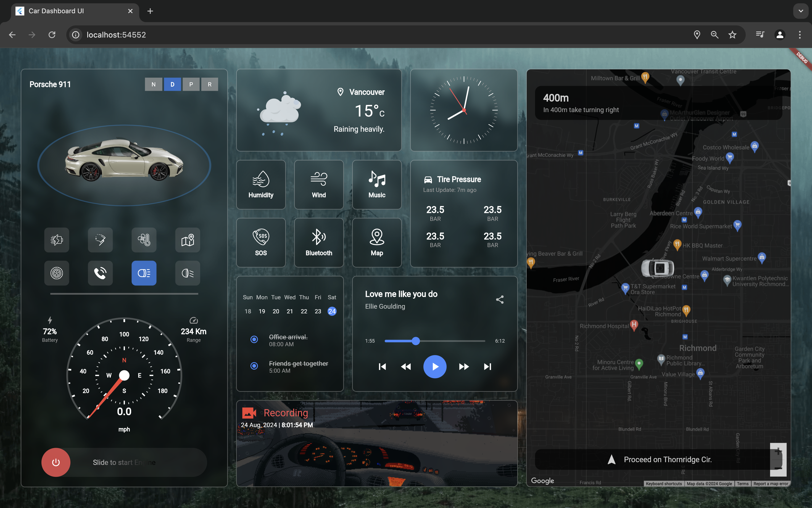

# Dash Pilot



Dash Pilot is a modern, customizable smart dashboard solution designed for cars. This project is built to enhance your driving experience by providing a visually appealing and feature-rich interface for your car’s smart dash monitor.

### 🚧 Status: In Development 🚧
This project is currently under active development. Contributions, ideas, and feature suggestions are welcome!

Add Map Api Key on Index.html for web and Runner AppDeligate for iOS. Responsiveness is under development, lower screen (zoom out) if overflow occurs. 

## Features

- **Real-time Navigation and Maps**: Integrated Google Maps with real-time navigation.
- **Glassmorphic Design**: Clean and modern UI with glassmorphic elements.
- **Analog and Digital Clock**: Customizable clocks with support for various styles.
- **Smart Car Metrics**: Track tire pressure, speed, fuel, and other metrics.
- **Music Player**: Control your media seamlessly while driving with album art display.
- **To-Do List and Schedule**: Manage your day-to-day tasks with a built-in calendar.
- **Camera View Simulation**: Front and rear car view with real-time video simulation.
- **Weather and Environment Info**: Get updates on humidity, wind speed, and other weather conditions.


## Installation

1. Clone the repository:
   ```bash
   git clone https://github.com/mhutshow/dash_pilot.git
   ```

2. Navigate to the project directory:
   ```bash
   cd dash_pilot
   ```

3. Install dependencies:
   ```bash
   flutter pub get
   ```

4. Run the project:
   ```bash
   flutter run
   ```

## Usage

This project can be used in any car equipped with a smart dash monitor running Android, iOS, or any web-compatible operating system.

## Contributing

Contributions are always welcome! If you want to contribute, please fork the repository and submit a pull request. Make sure your code follows the best practices and is well documented.

## License

This project is licensed under the MIT License. See the [LICENSE](LICENSE) file for more details.

## Contact

For any questions or suggestions, feel free to reach out via issues or at [mahedi.mhu@gmail.com](mailto:mahedi.mhu@gmail.com).
